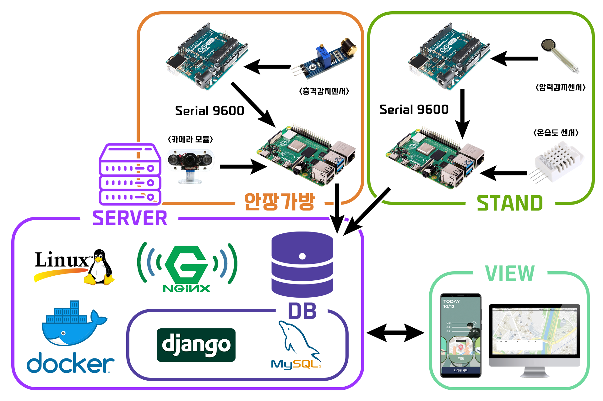

# 🥇2022 스마트 ICT 프로젝트 경진대회
>**참고**

>본 포트폴리오는 2022년 스마트 ICT 프로젝트 경진대회 **최우수상**을 수상한 작품을 포트폴리오 형태로 축약한 웹입니다.
>자전거를 관리하기 위한 목적의 자전거 길찾기 지도, 자전거 정비소나 사고 다발 지역의 위치를 나타내는 테마지도가 포함되어 있습니다.

>※ 백엔드, DB를 관리하던 서버의 문제로 관리모드에서 기능은 현재 수행하지 못하는 상태입니다.

## 🚴작품 개요

**아두이노와 라즈베리파이를 이용한 자전거 관리 시스템 Care Bicycle Case**
>**개요** 자전거 인구의 급증에 따라 안전 사고가 증가하였다. Care Bicycle Case는 자전 거 정비를 통해 미리 안전 사고를 방지하고, 블랙박스 기능을 도입하여 사고 발 생 시 사용자에게 정확한 사고 정황파악을 할 수 있도록 도와준다. 라이딩이 끝 났을 시에는 자체제작 자전거 거치대를 통해 공기압 측정을 해줌으로서 라이딩 전, 중, 후 사고 위험요소를 한번에 관리하여 예방하는 시스템을 제공한다.

## 🧑‍💻개발환경 & 개발자

>**개발환경**

>📱Android Studio, Kotlin

>🖥️Javascript , html, css

>📲Django, Python, Mysql

>🦾Raspberry Pi, Arduino, C

>🔒Linux, docker

|**이름**|**역할**|
|----------------|-------------------------------|
|나강민|`팀장` `Android`|
|유현호|`부팀장` `Front-End` `System Design`|
|이수한|`서기` `Back-End`|
|박보민|`자료` `Server` `System Dev`|
|유다인|`재료` `Back-End`|
|박선혜|`발표` `Android`|

## 🎞️작품 구성

>🅿️**자전거 거치대** 압력감지 센서로 자전거 거치 여부를 감지하고 온습도와 GPS 정보를 앱에 전달한 다. 안장 가방 시스템의 충전이 이루어진다.

>🚲**라이딩 모드** 앱에서는 자전거를 탈 때 라이딩 거리, 시간, 현재 속도 등을 띄워주고, 안장가방에 서 충격감지, 카메라, 온습도, 등의 센서를 이용해 라이딩 시 위험을 감지하여 알린다.

>💁**자전거 관리** 온습도 센서를 이용해 현재 환경이 자전거에게 알맞은 환경인지 알려준다. 충격감지, 라이딩한 거리에 따라 자전거 부품의 수명을 알려준다.

>🧑‍💼**관리자 페이지** 모든 사용자의 실시간사고와 도난사고를 방지하기 위한 관리목적으로 제작 되었다. GPS, 충격감지 센싱값을 백엔드 API 통신을 통해 관리자가 사용자들에게 위험사실을 전달해준다.
